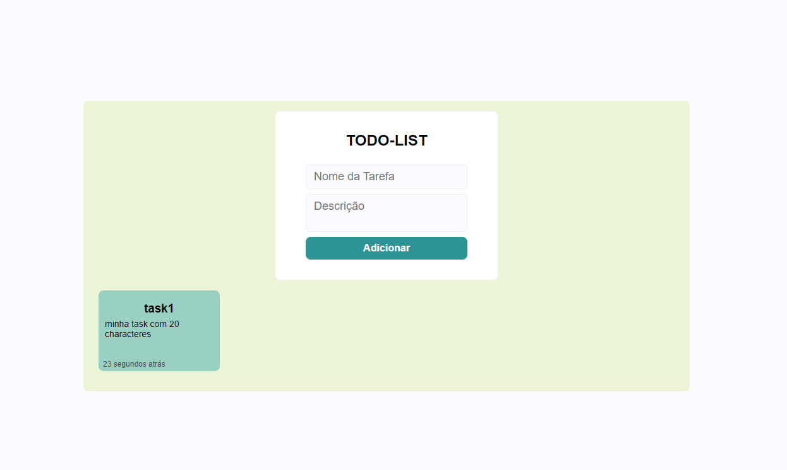

# TODO List

Nesta atividade tentei fazer um frontend para não ficar somente um menu, mesmo querendo usar typescript durante todo o projeto. Separei as responsabilidades em 2 arquivos principais,

* `index.js` onde tem a lógica básica que não envolve manipulação de DOM. Apenas as funções e validações pedidas.
* `frontend.js` onde tem toda a lógica do frontend manipulando DOM

